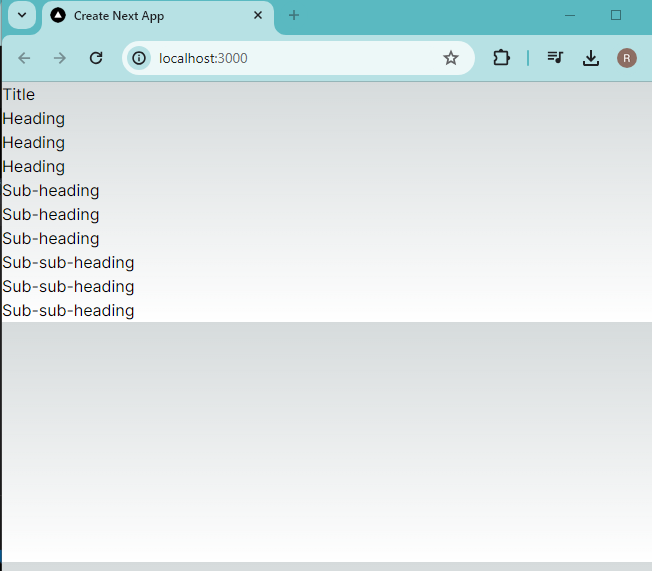
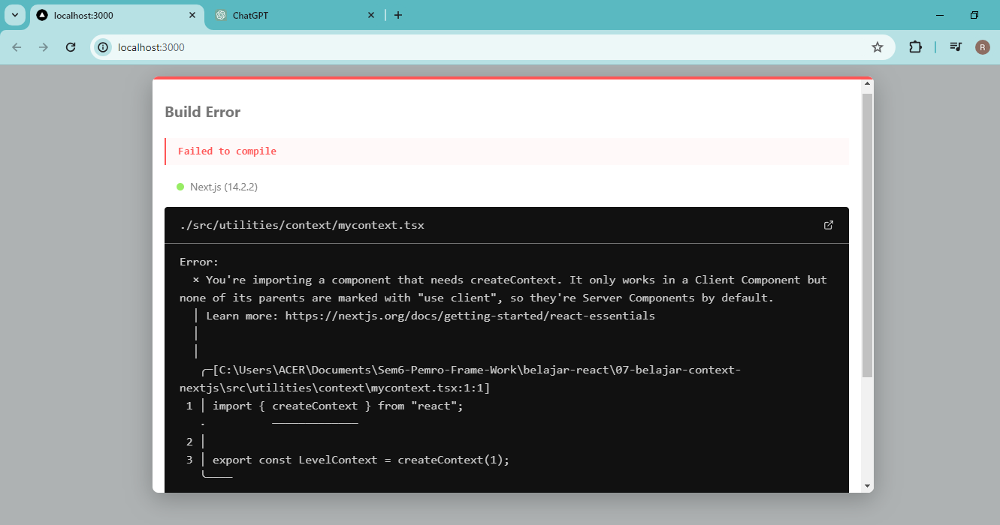
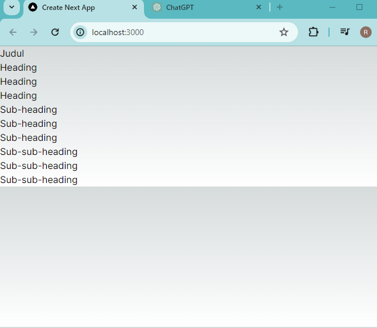
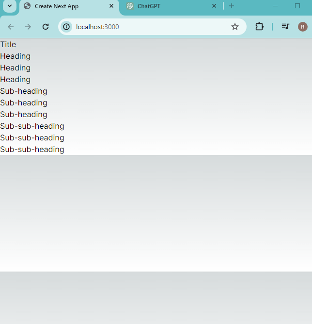

### Laporan Practicum - 7

## Practicum Report
|  | Pemrograman Berbasis Framework 2024 |
|--|--|
| NIM |  2141720166|
| Nama |  Raihan Dany Radhinnur |
| Kelas | TI - 3I |

## Practicum - 1 a
Capture hasilnya dan buatlah laporan di README.md. Jelaskan apa yang telah Anda pelajari dan bagaimana tampilannya saat ini?
Answer : 
    In the results of this website in practicum 01, it displays the title and sections on the main page of the website. This can be done using components from the components folder. In the component file folder there are files such as atoms (which store headings and sections) and templates (store main_page files) these are called child components which will later be needed/appeared in the parent component (main_pages).
Result Practicum :
|

## Practicum - 1 b
Capture hasilnya dan buatlah laporan di README.md. Jelaskan apa yang telah Anda pelajari dan bagaimana tampilannya saat ini?

Jika terjadi error, silakan perbaiki, Mengapa hal itu bisa terjadi? Jelaskan!

Answer : 
    From the practice result the Error shows that I get, I think this is happening because the createContext function only works in the Client component instead of the Server component which is normally created in Next.js. To solve this problem I found we need to use client code in each related file (mycontext.tsx, heading.tsx, section.tsx).
Result Practicum :
Default Error Code
|
Solve Code
|

## Practicum - 1 C
Capture hasilnya dan buatlah laporan di README.md. Jelaskan apa yang telah Anda pelajari dan bagaimana tampilannya saat ini?

Jangan lupa push dengan pesan commit: "W07: Jawaban soal 3".

Answer:
    In this practicum we try to use component level sections not manually. By changing the code a little, namely level + 1 in heading.tsx, the reason is because Sections tend to read information from the components above them, each Section can read the level from the Section above it, and pass level + 1 down automatically.
Result Practicum :
|